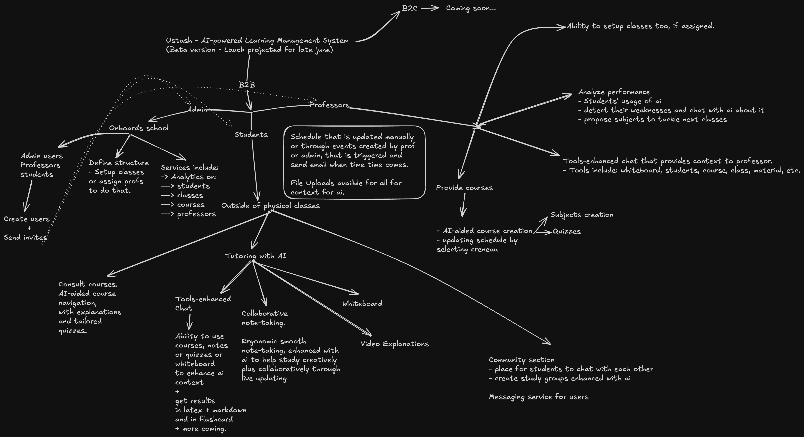

## Use useswr instead of await fetch
## Add captcha to auth andto all unauthed forms
## Build a blog

  

# 🧑‍🏫 Ustadh — AI-powered LMS

---

## 🚧 Roadmap

### ✅ Core Features

- ✅ Add Captcha in auth
- ✅ Add Amazigh language to i18n
- ✅ Block student from browsing when on an exam
- ✅ If user is logged in and goes to landing page, redirect to dashboard
- ✅ Schedule management: Allow upload via image → JSON or manual entry
- ✅ Implement CSRF protection
- ✅ Store JWT in httpOnly cookie (not localStorage)

### 🏫 School Onboarding

- Role-based UI and navigation
- `updateUser` on `AuthProvider`
- Analytics tables
- Community services + messaging
- Tutoring services with **Ibn Battuta** branding
- Admin & Professor UI (especially Professor)

### ✨ User Features

- Real-time notes (WebSocket integration)
- EditorJS for notes
- Chat prompt templates by user level (primary → university)
- Quizzes
- "Report a Bug" in sidebar
- Student performance analysis + improvement suggestions

### 📅 Sprint (19/04 → 26/04)

- Finalize Community & Tutoring services
- Build solid Admin/Professor interface
- Implement AI data layer for RAG
- Scrape, curate, and upload Moroccan school data

### 🧪 Sync Feature

- `Synchronize avec l’école` → Fetches schedule updates

### Messaging Logic

- Display only relevant contacts:
  - Students see only relevant teachers
  - Admins and Professors can message anyone

---

## 🛠 Deployment Strategy for MVP

### 🧱 Stack Overview

- **Backend**: FastAPI (Cloud Run)
- **Clients**: React Native / Next.js (Vercel or Firebase)
- **Database**: Neon (PostgreSQL)
- **Cache & Queue**: Upstash Redis
- **Worker**: Celery (Cloud Run Jobs)
- **Email**: SendGrid or Mailgun
- **Storage**: Cloud Storage (optional)

---

### 🚀 Deployment Steps

#### 1. Backend

- Dockerize FastAPI
- Deploy to Cloud Run (`min-instances=0`)
- Use GCP Secret Manager for environment variables

#### 2. Clients

- Web: Deploy to Vercel or Cloud Run
- Mobile: Connect via HTTPS

#### 3. Database

- Neon PostgreSQL
- Enable connection pooling
- Secrets managed via GCP

#### 4. Celery Worker

- Containerized and deployed via Cloud Run Jobs
- Broker: Upstash Redis

#### 5. Email Function

- Triggered via Cloud Function or Pub/Sub
- Use SendGrid or Mailgun API

#### 6. Config & Secrets

- Managed through GCP Secret Manager

---

### 📊 Monitoring & Budget

- Enable Cloud Monitoring & Logging
- Set alerts for:
  - Error rate
  - Monthly cost
  - Redis usage
- Use free tiers (Neon, Upstash, GCP)

---

## ✅ MVP Summary

- Scalable up to 5,000 users
- ~$20–40/month
- Built for rapid iteration

---

## 🔮 Upcoming (May)

- Launch **AgentX** with full AI features
- Build robust user interface
- Replace `int` with `uuid` where needed
- Add floating modern header

---

## for messaging, only disply contacts, eligible ones for that type of user, if admin or professor then all, else, restrictions.
